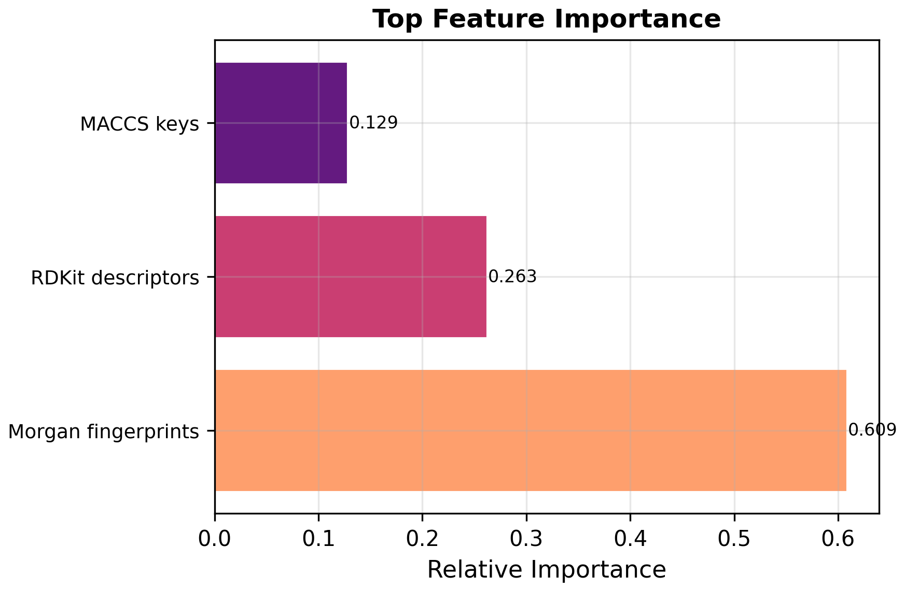
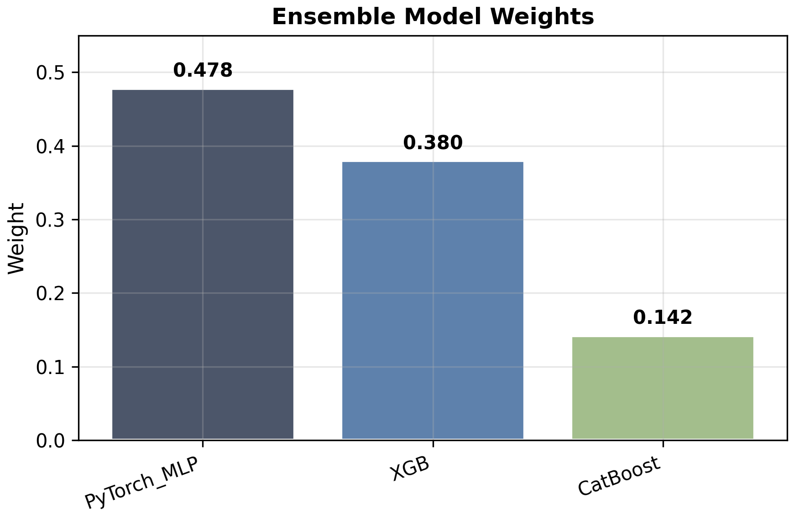

<h1 align="center">Lipophilicity-QSAR</h1>
<p align="center"><strong>Enhanced Structure Feature Fusion and Ensemble Learning for Drug Property Prediction</strong></p>
<p align="center">一个面向药物脂溶性预测的端到端 QSAR 项目，融合多模态分子表征、异构集成学习、scaffold-aware 验证与 SHAP 可解释性分析。</p>

<p align="center">
  
  
  
  
</p>

<p align="center">
  <a href="#overview">Overview</a> •
  <a href="#highlights">Highlights</a> •
  <a href="#results">Results</a> •
  <a href="#visuals">Visuals</a> •
  <a href="#quick-start">Quick Start</a> •
  <a href="#web-demo">Web Demo</a> •
  <a href="#project-structure">Project Structure</a>
</p>

<p align="center">
  
</p>

## Overview

本项目围绕公开真实分子数据集 `Lipophilicity`，根据分子结构预测实验脂溶性 `exp`（连续变量，logD）。整体流程覆盖数据处理、特征工程、模型训练、严格验证、结果解释以及 Web 部署，目标不是只做一个分数，而是完成一个结构完整、展示友好的 QSAR 项目。

| Item | Details |
| --- | --- |
| Task | 根据分子结构预测实验脂溶性 `exp` |
| Dataset | MoleculeNet / DeepChem `Lipophilicity` |
| Scale | 4,200 molecules |
| Data origin | 真实实验数据，带 `CMPD_CHEMBLID` 映射 |
| Best model | `Weighted_Ensemble_rich` |
| Best test metrics | `R² = 0.7232`, `RMSE = 0.6346`, `MAE = 0.4517` |
| Strict validation | Scaffold-aware repeated split, `R² = 0.7138 ± 0.0215` |

## Highlights

| Module | What is included | Why it matters |
| --- | --- | --- |
| Feature fusion | RDKit 2D descriptors, Morgan Fingerprint, MACCS Keys | 同时编码理化性质、局部子结构和药效团模式 |
| Heterogeneous models | XGBoost, CatBoost, PyTorch MLP | 结合树模型与深度学习的互补能力 |
| Ensemble learning | Validation-based weighted ensemble | 在单模型基础上进一步提升泛化性能 |
| Reliable evaluation | Random split + scaffold-aware repeated split | 比单纯随机划分更接近真实药物研发场景 |
| Interpretability | SHAP global/local analysis, scaffold statistics, chemical space visualization | 不只回答“准不准”，还能回答“为什么” |
| Deployment | Flask + Docker + Hugging Face Space | 可直接展示网页端推理与 API 调用 |

### Feature Representation

项目使用三类结构特征对分子进行多视角表征：

1. `RDKit` 全量 2D 描述符，经筛选后保留 173 维高价值特征。
2. `Morgan Fingerprint`，`radius=2`，`2048-bit`。
3. `MACCS Keys`，`167-bit`。

这种组合既能覆盖分子整体理化性质，也能编码局部连接模式和常见结构键特征。

### Modeling Pipeline

`SMILES -> Featurization -> Base Models -> Weighted Ensemble -> Scaffold-aware Validation -> SHAP Interpretation`

所有实验留痕和关键步骤日志会自动写入 `docs/worklog/`，核心结果输出至 `results/`，模型文件保存到 `models/`。

## Results

### Standard Test Split

| Model | R² | RMSE | MAE |
| --- | ---: | ---: | ---: |
| **Weighted_Ensemble_rich** | **0.7232** | **0.6346** | **0.4517** |
| XGB_rich_desc_fp_maccs | 0.7043 | 0.6559 | 0.4810 |
| CatBoost_rich_desc_fp_maccs | 0.6973 | 0.6637 | 0.4862 |
| PyTorch_MLP_rich_desc_fp_maccs | 0.6967 | 0.6643 | 0.4634 |
| *Baseline (`XGB_desc_fp`)* | *0.6835* | *0.6787* | *0.5075* |

### Scaffold-Aware Repeated Split

相比普通随机划分，scaffold-aware 划分更严格，因为它要求训练集和测试集尽量来自不同的骨架结构，更能反映模型面对新化学骨架时的真实泛化能力。

| Model | R² (mean ± std) | RMSE (mean ± std) |
| --- | ---: | ---: |
| **Weighted_Ensemble_scaffold** | **0.7138 ± 0.0215** | **0.6489 ± 0.0296** |
| PyTorch_MLP_rich_scaffold | 0.6945 ± 0.0261 | 0.6698 ± 0.0200 |
| XGB_rich_scaffold | 0.6847 ± 0.0234 | 0.6811 ± 0.0347 |
| CatBoost_rich_scaffold | 0.6750 ± 0.0234 | 0.6914 ± 0.0295 |
| *Baseline (`XGB_scaffold`)* | *0.6472 ± 0.0311* | *0.7200 ± 0.0299* |

### Improvement vs Baseline

| Version | Best model | R² | RMSE | MAE |
| --- | --- | ---: | ---: | ---: |
| Previous baseline | `XGB_desc_fp` | 0.6835 | 0.6787 | 0.5075 |
| Enhanced pipeline | `Weighted_Ensemble_rich` | 0.7232 | 0.6346 | 0.4517 |

- `R²` 提升：`+0.0397`
- `RMSE` 下降：`-0.0440`

这说明更丰富的结构表征和异构模型集成确实带来了稳定收益，而不是偶然波动。

## Interpretability

为避免 QSAR 模型停留在“黑箱预测”，项目加入了 SHAP 全局与局部解释分析。当前全局贡献最高的前 5 个特征为：

1. `MolLogP`
2. `fr_COO`
3. `VSA_EState5`
4. `MACCS_104`
5. `SMR_VSA10`

相关输出文件包括：

- `results/shap_case_studies.md`
- `figures/19_shap_top20_bar.png`
- `figures/20_shap_beeswarm_top20.png`
- `figures/21_shap_local_highprediction.png`
- `figures/21_shap_local_lowprediction.png`
- `figures/21_shap_local_largeerror.png`
- `figures/22_shap_case_molecules.png`

## Visuals

<p align="center">
  
  
</p>

<p align="center">
  
  
</p>

<p align="center">
  
</p>

这些图分别对应化学空间分布、骨架统计、特征贡献和集成预测效果，比较适合放在 GitHub 首页作为项目视觉锚点。

## Quick Start

### Run the Full Pipeline

```bash
conda activate cptac
python run.py
```

### Run Strict Validation and SHAP Analysis

```bash
python scripts/run_scaffold_shap_validation.py
```

### Key Outputs

- Results summary: `results/final_results_v2.md`
- Test predictions: `results/test_predictions.csv`
- Scaffold validation: `results/scaffold_validation_results.md`
- Final models: `models/`
- Work logs: `docs/worklog/`

## Web Demo

项目包含一个可公开部署的 Web 演示平台，支持单分子 `SMILES` 预测、结果展示和 JSON API 调用。

### Online Demo

[Hugging Face Spaces Demo](https://students-cs-pharmacy-prediction-platform.hf.space)

### Local Launch

```bash
cd hf_space
python app.py
```

默认访问地址：`http://localhost:7860`

### JSON API Example

接口：`POST /api/predict`

```json
{
  "smiles": "Cn1c(CN2CCN(CC2)c3ccc(Cl)cc3)nc4ccccc14"
}
```

## Project Structure

<details>
<summary>Expand repository tree</summary>

```text
qsar_project/
├── data/                  # 原始与示例数据
├── docs/
│   └── worklog/           # 实验过程日志与留痕
├── figures/               # 数据分析、性能对比、SHAP、Scaffold 图表
├── hf_space/              # Web 演示平台与 Docker 部署配置
├── models/                # 训练好的模型与预处理器
├── results/               # 指标汇总、预测结果、验证报告
├── scripts/               # 训练、验证、打包与发布脚本
├── src/                   # 核心源码
│   ├── data_utils.py
│   ├── featurization.py
│   ├── train_model.py
│   ├── evaluate.py
│   ├── scaffold_validation.py
│   ├── structure_analysis.py
│   ├── statistical_analysis.py
│   └── professional_viz.py
├── run.py                 # 主执行入口
├── QUICK_START.md         # 快速启动说明
├── README.md              # 项目主说明
└── project_overview.md    # GitHub 展示版概览
```

</details>

## Why This Project Stands Out

- 任务聚焦明确，直接对应药物发现中重要的 ADME 相关性质预测。
- 结构表征、模型构建、严格验证和解释分析形成了完整闭环，不只是单点实验。
- 页面中直接内嵌关键图表，更适合 GitHub 场景下的快速浏览和展示。
- 代码、结果、模型和实验留痕同时保留，可复现性和展示性都比较完整。

## Future Work

- [ ] 引入图神经网络（GNN）进行端到端分子表征学习。
- [ ] 增加完全独立的外部验证集（external validation set）。
- [ ] 扩展为多任务学习，同时预测脂溶性与其他 ADME 相关性质。
