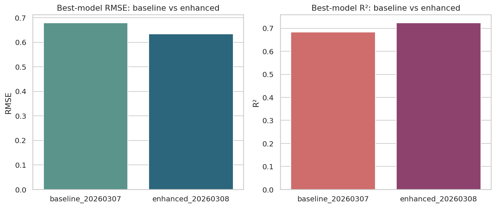
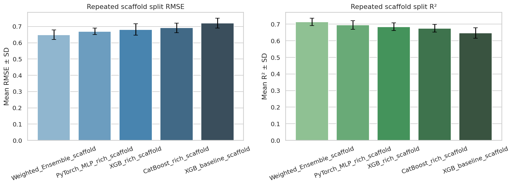
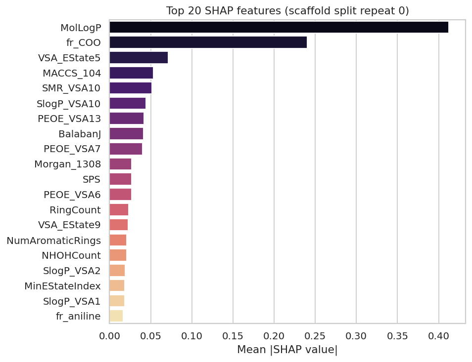
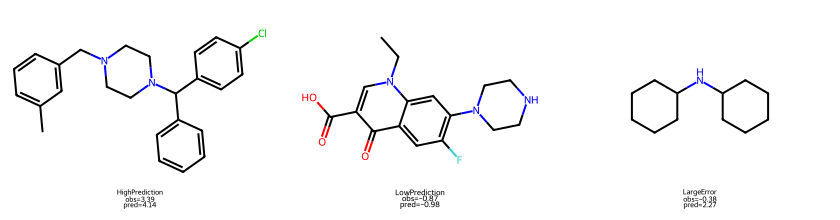

# 面向非本领域读者的完整项目报告：可解释药物脂溶性预测平台

> 版本：2026-03-15  
> 项目目录：`/public/home/zhw/cptac/projects/experiment/qsar_project`  
> 适用对象：药学研究生复试、跨学科答辩、GitHub 项目介绍、Hugging Face 平台说明  
> 读者假设：默认读者不同时具备药学、化学信息学和机器学习背景，因此本报告会先解释“为什么要做”，再解释“怎么做”，最后解释“结果意味着什么”。

---

## 一、先用一句话讲清楚这个项目

这个项目做的事情是：

**根据一个分子的结构（SMILES），用真实公开数据训练得到的模型去预测它的脂溶性，并进一步用可解释性方法说明模型为什么这么判断，最后把结果做成可以直接访问的网页和 API。**

如果再口语一点，可以把它理解成：

> 这是一个“药物分子实验前预筛选助手”。

你给它一个分子的结构，它先告诉你这个分子大概更偏亲水还是疏水，然后再告诉你：模型主要是根据哪些结构或理化特征做出这个判断的。这样，药化人员可以更有依据地决定：

- 这个分子值不值得继续做实验；
- 如果想把它改得更亲水或更疏水，结构上可能往哪个方向修改更合理。

---

## 二、这个项目为什么重要

### 2.1 药学背景：为什么要关注脂溶性

脂溶性（lipophilicity，常见表征是 logD 或 logP）是药物研发中非常关键的性质。它会影响：

- **吸收（Absorption）**：分子能不能比较容易通过生物膜；
- **分布（Distribution）**：进入体内后更容易停留在血液、水相环境，还是进入脂质丰富的组织；
- **膜通透性（Membrane permeability）**：对口服药、脑靶向药等都很关键；
- **成药性（Drug-likeness）**：太亲水或太疏水都可能带来问题。

可以粗略理解为：

- **脂溶性太低**：分子可能不容易穿膜，吸收差；
- **脂溶性太高**：分子虽然更容易穿膜，但可能溶解性差、非特异性结合增多、体内暴露不可控。

所以在药物设计里，脂溶性经常不是“越高越好”或“越低越好”，而是**要平衡**。

### 2.2 现实痛点：实验可靠，但代价高

当然，最可靠的办法始终是做实验测量。但实验存在几个现实问题：

- 成本高；
- 周期长；
- 不能对大量候选分子都优先做完实验再决策。

因此，一个很自然的问题是：

> 能不能在实验之前，先用计算方法做一次“预筛选”？

这就是本项目的切入点。

---

## 三、这个项目到底解决了什么问题

项目的目标不是做一个“花哨的模型”，而是解决一个**真实的研发决策问题**：

> 对一个新分子，在还没做实验之前，我们能不能基于结构大致判断它的脂溶性，并给出可解释的结构层面提示？

因此，这个项目有三个层次的目标：

1. **预测层**：模型能不能把脂溶性预测得比较准；
2. **验证层**：模型是不是只在随机划分里看起来很厉害，还是在更严格设定下依然稳；
3. **解释层**：模型能不能告诉我们“为什么这么判断”，而不是只给一个数。

再往前走一步，我们还把它做成了一个小型平台，所以还有第四层目标：

4. **平台层**：别人能不能不看代码、直接打开网页体验这个项目。

---

## 四、项目的完整工作流（从头到尾）

这个项目可以分成 9 个步骤：

1. 明确研究问题  
2. 获取真实公开数据  
3. 清洗与标准化分子结构  
4. 构建多种分子特征  
5. 训练基线模型与增强模型  
6. 比较模型性能  
7. 做更严格的 scaffold 验证  
8. 做 SHAP 可解释性分析  
9. 做成网页平台与 API

下面逐步解释。

---

## 五、数据从哪里来，为什么可信

### 5.1 数据来源

本项目使用的是公开 `Lipophilicity` 数据集，来自 MoleculeNet / DeepChem 体系，对应真实药物样分子的实验脂溶性记录。

项目中已经整理的数据概况：

- 数据集规模：`4200` 个分子
- 目标变量：实验脂溶性（logD）
- 数据来源特征：包含 `ChEMBL` 编号
- 项目内摘要文件：`results/dataset_summary.json`

### 5.2 为什么这点重要

这意味着：

- 不是自己随手构造的模拟数据；
- 不是为了“做高分”专门拼凑的数据；
- 数据背后有公开数据库来源，可以追溯。

对于药学复试来说，这一点非常关键。因为老师往往不只关心你“会不会调模型”，还关心你：

- 会不会处理真实科研数据；
- 知不知道公开数据库的重要性；
- 有没有可复现意识。

### 5.3 数据清洗做了什么

项目先对原始数据做了这些处理：

- 校验 `SMILES` 是否能被 RDKit 正确解析；
- 统一成标准化结构表示；
- 去掉无效或重复结构；
- 保留可用于建模的真实标签。

可以理解为：

> 在开始训练模型之前，先把“分子结构数据”变成干净、统一、可计算的输入。

---

## 六、怎么把分子变成机器能理解的数字

一个分子的 `SMILES` 是字符串，不能直接喂给机器学习模型。  
所以我们必须把分子结构转成数字特征。这个过程叫 **特征工程**。

本项目使用了三类特征。

### 6.1 基础理化描述符

这类特征偏“药学常识”，代表分子的整体性质，例如：

- `MolWt`：分子量
- `MolLogP`：疏水性/脂溶性相关指标
- `TPSA`：拓扑极性表面积
- `HBD/HBA`：氢键供体/受体数
- `RingCount`：环数
- `QED`：类药性评分

这类特征好处是：

- 容易解释；
- 和药学语言直接对应；
- 很适合答辩时讲清楚模型在学什么。

### 6.2 RDKit 全量 2D 描述符

除了基础描述符之外，项目进一步计算了更全面的 2D 描述符，然后在训练集内做筛选：

- 去掉缺失列；
- 去掉零方差列；
- 去掉高度相关列。

最后保留了 **173 个有效描述符**。

这一步的意义是：

- 让模型看到更多结构相关信息；
- 但又避免无效特征和冗余特征拖累模型。

### 6.3 分子指纹：Morgan + MACCS

这类特征更像“结构片段编码”。

- **Morgan Fingerprint**：描述分子局部原子环境和子结构模式；
- **MACCS Keys**：描述常见结构键和化学片段是否存在。

可以把它们粗略理解成：

> 描述符更像“分子的整体体检报告”，  
> 指纹更像“分子有哪些局部结构片段的编码表”。

### 6.4 为什么要多种特征一起用

因为脂溶性这个性质不是由单一因素决定的。

它既和：

- 分子整体大小、极性、氢键能力

有关，也和：

- 某些具体结构片段、官能团、骨架模式

有关。

所以本项目选择：

> **基础描述符 + 扩展描述符 + 结构指纹**

来共同表达分子。

---

## 七、模型是怎么一步步升级的

### 7.1 先做基线模型

我们没有一上来就堆复杂方法，而是先做了几类基线模型：

- 随机森林（Random Forest）
- 支持向量回归（SVR）
- 基线版 XGBoost

这样做的好处是：

- 先知道一个合理起点；
- 后续每次升级都能比较“到底有没有真正进步”。

### 7.2 做增强模型

在增强版里，项目引入了：

- 增强特征输入（描述符 + Morgan + MACCS）
- XGBoost（增强版）
- CatBoost
- PyTorch MLP
- 加权集成（Weighted Ensemble）

这里的思路不是“哪个模型最炫就用哪个”，而是：

- 树模型（XGBoost / CatBoost）对结构化特征很强；
- MLP 可以学习高维连续特征的复杂组合；
- 三者的错误模式并不完全一样；
- 所以做集成往往能更稳。

### 7.3 为什么集成模型是最终最优解

最终最佳模型是：

- `Weighted_Ensemble_rich`

它本质上不是重新训练了一个更复杂的“大一统模型”，而是：

- 把 XGBoost、CatBoost、MLP 的输出按验证集上优化得到的权重做组合。

也就是说：

> 我们不是盲目追求“单个模型必须赢”，而是利用不同模型之间的互补性。

这是一种很典型、也很成熟的工程与科研思路。

---

## 八、模型到底表现怎么样

### 8.1 普通测试集结果

增强版最终结果如下（来自 `results/final_results_v2.md`）：

| 模型 | R² | RMSE | MAE |
|---|---:|---:|---:|
| Weighted_Ensemble_rich | 0.7232 | 0.6346 | 0.4517 |
| XGB_rich_desc_fp_maccs | 0.7043 | 0.6559 | 0.4810 |
| CatBoost_rich_desc_fp_maccs | 0.6973 | 0.6637 | 0.4862 |
| PyTorch_MLP_rich_desc_fp_maccs | 0.6967 | 0.6643 | 0.4634 |
| XGB_baseline_desc_fp | 0.6835 | 0.6787 | 0.5075 |

### 8.2 这些数字怎么理解

- **R² 越高越好**：表示模型对真实变化的解释能力更强；
- **RMSE 越低越好**：表示预测误差更小；
- **MAE 越低越好**：表示平均绝对偏差更小。

从结果上看：

- 增强版模型整体优于基线；
- 集成模型最好；
- 深度学习模型单独也很强，但最终集成更稳。

### 8.3 相比上一版提升了什么

上一版最佳是：

- `XGB_desc_fp`
- Test `R² = 0.6835`
- Test `RMSE = 0.6787`

增强版最佳是：

- `Weighted_Ensemble_rich`
- Test `R² = 0.7232`
- Test `RMSE = 0.6346`

也就是：

- `R²` 提升了 `0.0397`
- `RMSE` 降低了 `0.0440`

这说明增强并不是“做了很多事但没效果”，而是带来了明确收益。

---

## 九、为什么还要做更严格的验证

如果只做普通随机划分，老师可能会问：

> 这些分子是不是在训练集和测试集里其实很像，所以模型看起来很厉害？

这个问题非常关键。因为在真实药物研发里，模型常常面对的是：

- 一个**新骨架（new scaffold）**的分子，
- 而不是和训练集高度相似的分子。

### 9.1 什么是 scaffold split

scaffold 可以理解为分子的“骨架框架”。  
如果训练集和测试集共享大量相似骨架，那么模型在测试集上的表现可能会偏乐观。

所以项目进一步加入了：

- **5 次 repeated scaffold split**

也就是说：

- 让训练集和测试集尽量在骨架层面分开；
- 重复多次，计算平均值和标准差；
- 看模型是否稳定，而不是只看一次运气。

### 9.2 严格验证结果

来自 `results/scaffold_validation_results.md`：

| 模型 | R² mean ± std | RMSE mean ± std | MAE mean ± std |
|---|---:|---:|---:|
| Weighted_Ensemble_scaffold | 0.7138 ± 0.0215 | 0.6489 ± 0.0296 | 0.4962 ± 0.0226 |
| PyTorch_MLP_rich_scaffold | 0.6945 ± 0.0261 | 0.6698 ± 0.0200 | 0.5111 ± 0.0187 |
| XGB_rich_scaffold | 0.6847 ± 0.0234 | 0.6811 ± 0.0347 | 0.5241 ± 0.0252 |
| CatBoost_rich_scaffold | 0.6750 ± 0.0234 | 0.6914 ± 0.0295 | 0.5313 ± 0.0201 |
| XGB_baseline_scaffold | 0.6472 ± 0.0311 | 0.7200 ± 0.0299 | 0.5519 ± 0.0234 |

### 9.3 为什么这组结果很重要

这组结果通常会比随机划分更低，这是**正常的**。因为验证变严格了。

真正重要的是：

- 增强版在严格 scaffold 设定下依然明显优于基线；
- 集成模型依然是最优；
- 标准差不大，说明重复实验比较稳定。

这会让老师觉得你不是只会“做一个漂亮分数”，而是知道：

> **科研里要证明模型真的能泛化。**

---

## 十、SHAP 和 XAI 到底证明了什么

很多模型预测项目只停留在：

- 输入分子
- 输出一个数字

但这在答辩里很容易被追问：

- 模型为什么这么判断？
- 你怎么证明它学到的是有意义的东西？
- 这个结果对药化修改有什么指导价值？

所以项目加了 **SHAP（SHapley Additive exPlanations）**，这就是一类典型的 **XAI（可解释人工智能）** 方法。

### 10.1 SHAP 的两个层面

#### 全局解释

说明整个模型最重视哪些特征。

项目中排名靠前的特征包括：

- `MolLogP`
- `fr_COO`
- `VSA_EState5`
- `MACCS_104`
- `SMR_VSA10`

这很有意义，因为：

- `MolLogP` 和脂溶性本身高度相关；
- 酸性基团、极性表面积等也会影响分子在水相/脂相中的分配行为；
- 说明模型并不是在抓毫无意义的噪声。

#### 局部解释

说明对**某一个具体分子**，哪些特征在把预测值往上推，哪些在往下拉。

项目还专门挑了 3 个案例：

- `HighPrediction`
- `LowPrediction`
- `LargeError`

这样就能回答：

> 为什么这个分子会被预测成高脂溶性？  
> 为什么另一个分子会被预测成低脂溶性？  
> 为什么有的分子模型会判断失误？

### 10.2 SHAP 对答辩的价值

SHAP 不能证明因果，但它能证明：

- 模型判断有迹可循；
- 重要特征与药学常识相符；
- 对单个分子可以给出“结构方向上的解释提示”。

你可以把它理解成：

> SHAP 让这个项目从“黑盒预测器”升级成“可解释的药化辅助工具”。

---

## 十一、这个项目做成平台意味着什么

很多课程项目只到“代码能跑”和“图画出来”为止。  
但这个项目进一步做成了：

- 网页前端
- JSON API
- Hugging Face Space 可部署演示平台

### 11.1 平台可以干什么

用户可以：

- 输入一个新的 `SMILES`
- 得到脂溶性预测值
- 看到结构图
- 看到正向和负向 SHAP 特征
- 查看项目核心结果图
- 查看严格验证结果
- 通过 API 调用预测接口

### 11.2 这为什么重要

因为这说明你不仅会：

- 训练模型
- 解释模型

你还会：

- 把模型包装成别人可以直接使用的工具
- 考虑部署与调用方式
- 考虑作品展示和工程落地

对计算机老师来说，这体现工程能力。  
对药学老师来说，这意味着项目更接近“真的能用”的科研工具。

---

## 十二、Gemini 在这个项目里扮演什么角色

Gemini 不是这个项目的**核心预测模型**，而是一个**辅助解释层**。

它的作用不是替代现有模型，而是把已有结果翻译得更适合人读。

### 12.1 核心模型和 Gemini 的分工

- **核心模型**负责：
  - 真实预测脂溶性
  - 产生数值结果
  - 产生 SHAP 特征贡献

- **Gemini**负责：
  - 把这些结果转换成更自然的中文说明
  - 生成药化优化建议
  - 输出适合答辩、展示或报告的语言版本

### 12.2 为什么这样设计是合理的

因为如果让 Gemini 直接“猜脂溶性”，那就失去了严格建模和可验证性。  
而现在的做法是：

> 先用真实训练得到的模型做预测，  
> 再用 Gemini 做语言层的辅助解释。

这样既保留了科研严谨性，又增强了可读性和展示性。

---

## 十三、项目最终交付了哪些东西

这个项目最终不是一个单文件脚本，而是一整套成果。

### 13.1 模型与结果

- 增强版模型文件
- 测试集结果表
- scaffold 验证结果表
- SHAP 结果表

### 13.2 图表

包括但不限于：

- 基线与增强版性能对比图
- 严格验证结果图
- SHAP 全局重要特征图
- SHAP 分子案例图
- 化学空间图
- scaffold 图

### 13.3 文档

- 项目说明
- 快速开始文档
- 报告
- 工作留痕

### 13.4 平台

- Flask 网页
- API 接口
- Hugging Face Space 部署包

这意味着它已经具备：

- **研究性**
- **工程性**
- **解释性**
- **展示性**

---

## 十四、如果完全不懂这个领域，怎么最快理解这个项目

你可以这样理解：

### 从药学角度看

这是一个帮药物研发做前期判断的小工具。  
它根据分子结构估计脂溶性，从而帮助判断这个分子是不是值得继续推进。

### 从计算机角度看

这是一个真实数据驱动的、带严格验证和可解释性的分子性质预测系统。  
它包含了：

- 特征工程
- 传统机器学习
- 深度学习
- 集成学习
- 严格验证
- XAI
- 平台部署

### 从产品角度看

这是一个可以输入分子、得到预测结果和解释，并能通过 API 被其他系统调用的在线工具。

---

## 十五、这份项目为什么“经得住拷问”

答辩里通常会遇到这些问题，而这个项目都能回答。

### 15.1 “你为什么选这个问题？”

因为脂溶性是药物研发中的关键性质，和吸收、分布、膜通透性直接相关，药学意义明确。

### 15.2 “你为什么选这个数据集？”

因为它是真实公开数据，不是模拟数据，有清晰来源，适合复现和对外展示。

### 15.3 “为什么不用一个模型就结束？”

因为不同模型对同一问题的优势不同，做比较和集成可以更稳、更有说服力。

### 15.4 “你怎么证明不是碰巧有效？”

因为做了：

- 基线比较
- 增强版比较
- repeated scaffold split 严格验证

### 15.5 “你怎么证明模型不是黑盒？”

因为加入了 SHAP：

- 有全局特征重要性
- 有单分子局部解释
- 能把预测与具体结构信息联系起来

### 15.6 “Gemini 是不是替代了模型？”

不是。Gemini 只做辅助解释，不做核心数值预测。

### 15.7 “为什么不直接做 GNN？”

不是不能做，而是当前这套方案已经在真实数据上取得稳定且可解释的结果，并且更容易复现、部署和展示。对于复试来说，这样更稳。

---

## 十六、项目目前的边界和不足

经得住拷问的项目，不是说“没有缺点”，而是说：

> 你知道自己的边界在哪里。

本项目目前还有这些局限：

1. 主要任务仍然是单一性质预测；
2. 虽然做了严格 scaffold 验证，但还没有外部独立测试集；
3. SHAP 给的是模型解释，不是因果生物机制；
4. Gemini 是辅助层，不应被当作核心科学结论来源。

这些局限并不减分，反而会让你的答辩显得成熟。

---

## 十七、后续还能怎么继续升级

如果后续还要继续增强，这几个方向最有价值：

- 外部独立测试集验证
- 更严格的 scaffold / time split
- 图神经网络（GNN）
- 多任务性质联合预测
- 用 SHAP 进一步做“可操作的分子改造建议表”
- Gemini 辅助解释做成多模式输出（药化模式、答辩模式、英文摘要模式）

---

## 十八、最后的总总结

这个项目最终形成的是一个完整的跨学科作品，而不是单一模型实验。

它把下面几件事串起来了：

- 真实公开数据
- 分子结构特征工程
- 基线模型与增强模型比较
- 集成学习
- scaffold 严格验证
- SHAP 可解释性
- 网页平台与 API
- Gemini 辅助解释层

如果要用一句最适合答辩的话来总结它，可以说：

> 这是一个从真实公开数据出发、经过结构增强建模、严格验证和可解释性分析，最终做成在线平台的可解释药物脂溶性预测项目。它不仅能预测一个分子的脂溶性，还能解释为什么这么判断，并把结果进一步转化成适合药学理解和展示的结构优化提示。

---

## 附录 A：项目中最重要的结果数字

### 随机划分最佳结果

- 最佳模型：`Weighted_Ensemble_rich`
- `R² = 0.7232`
- `RMSE = 0.6346`
- `MAE = 0.4517`

### 严格验证最佳结果

- 最佳模型：`Weighted_Ensemble_scaffold`
- `R² = 0.7138 ± 0.0215`
- `RMSE = 0.6489 ± 0.0296`
- `MAE = 0.4962 ± 0.0226`

### SHAP 最重要特征（前 5）

1. `MolLogP`
2. `fr_COO`
3. `VSA_EState5`
4. `MACCS_104`
5. `SMR_VSA10`

---

## 附录 B：建议优先展示的图片

如果需要做 PPT 或 GitHub 首页，最推荐优先展示这几张：

1. `../figures/14_baseline_vs_enhanced.png`
2. `../figures/16_scaffold_repeat_summary.png`
3. `../figures/19_shap_top20_bar.png`
4. `../figures/22_shap_case_molecules.png`

下面是对应示意：

### 图1：增强前后效果对比

### 图2：严格 scaffold 验证结果

### 图3：SHAP 全局重要特征

### 图4：局部解释代表分子

---

## 附录 C：建议老师追问时的标准回答模板

### 问：这个项目最重要的创新点是什么？

答：不是单纯追求一个更高的分数，而是把真实公开数据、结构增强建模、严格验证、SHAP 解释和在线平台结合起来，使它既有科研严谨性，也有展示和应用价值。

### 问：为什么你说它“可解释”？

答：因为不仅有全局重要特征，还有对单个分子的局部 SHAP 解释，可以知道哪些特征在把预测往上推、哪些在往下拉。

### 问：Gemini 在这里是不是“替代分析”？

答：不是。Gemini 不负责做核心预测，只负责把已经得到的模型结果翻译成更自然的药学和项目说明，所以它是解释层，不是核心科学结论来源。

### 问：为什么平台化也重要？

答：因为平台化说明这个项目不是停留在离线脚本层面，而是已经具备“别人可以直接访问和调用”的工具属性，这对计算机和交叉项目尤其重要。
