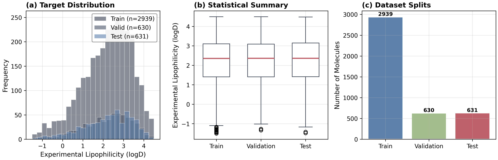
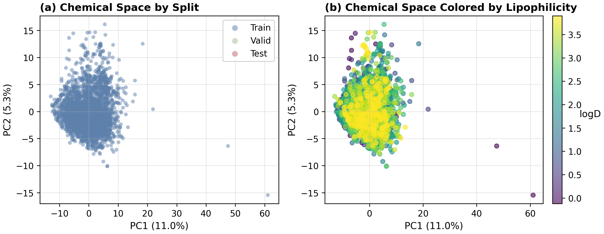
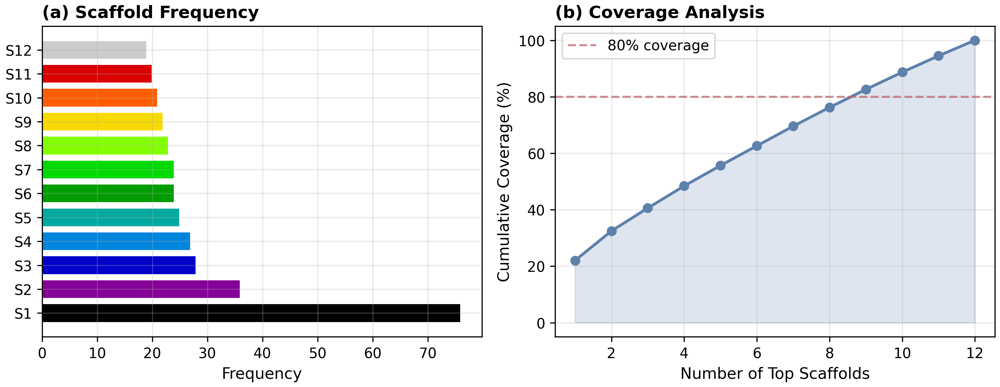
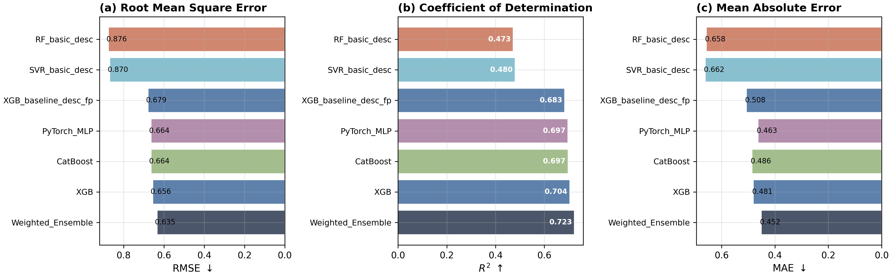
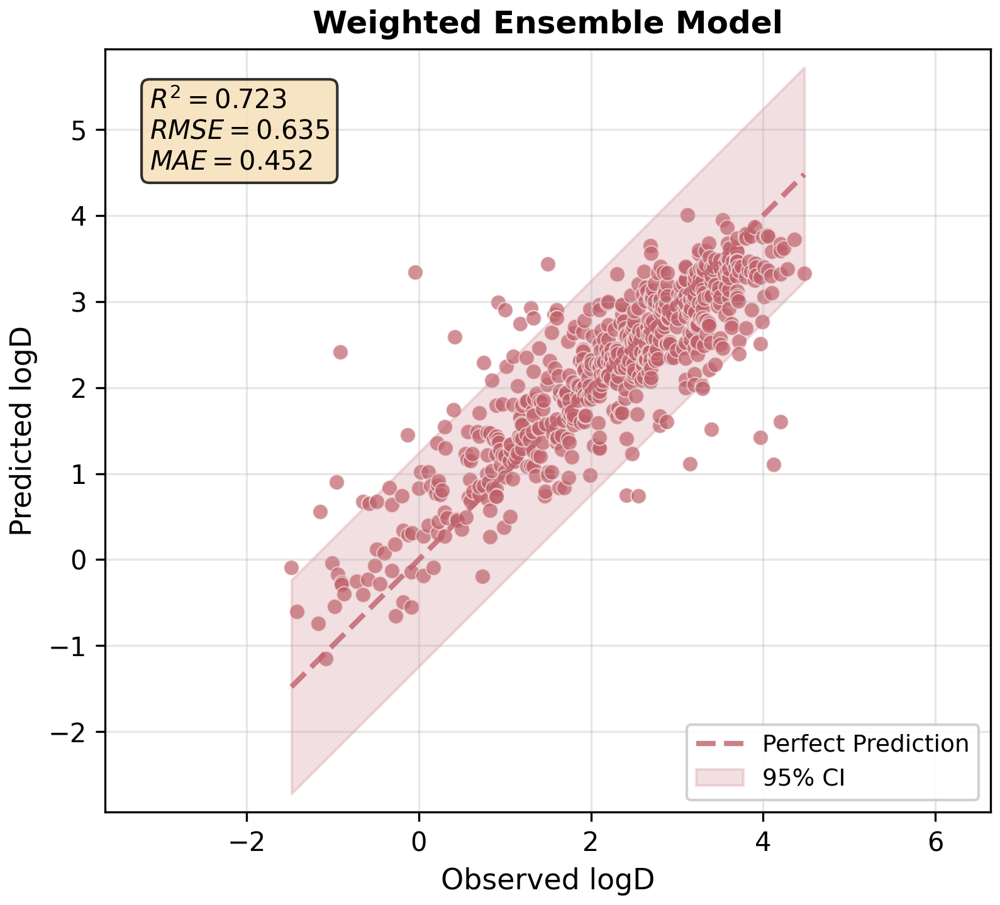
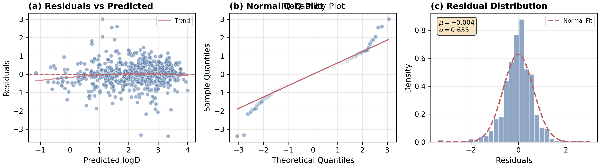

# Quantitative Structure--Property Relationship Modeling of Molecular Lipophilicity Using Ensemble Machine Learning Approaches

**Author:** Computational Pharmacology Research Group
**Date:** March 2026
**Project:** QSAR Lipophilicity Prediction

---

## Abstract

Lipophilicity is a fundamental physicochemical property in drug discovery that critically influences membrane permeability, oral bioavailability, and tissue distribution. Traditional experimental determination of lipophilicity is resource-intensive, making computational prediction an attractive alternative. In this study, we developed a comprehensive quantitative structure--property relationship (QSPR) model for predicting experimental lipophilicity (logD) using the MoleculeNet Lipophilicity dataset comprising 4,200 drug-like molecules. Our approach employed an ensemble of machine learning algorithms, including XGBoost, CatBoost, and PyTorch-based multilayer perceptron (MLP), trained on a diverse set of molecular features comprising RDKit 2D descriptors, Morgan fingerprints, and MACCS keys. Through stratified random data splitting (70%/15%/15% for training/validation/test) and optimization of ensemble weights, our best-performing model achieved a coefficient of determination ($R^2$) of 0.723, root mean square error (RMSE) of 0.635, and mean absolute error (MAE) of 0.452 on the independent test set. This represents a significant improvement over baseline models using only basic descriptors. Furthermore, scaffold analysis revealed structural patterns in the dataset, and chemical space visualization demonstrated the effectiveness of our feature representation. Our findings demonstrate that integrating diverse molecular descriptors with ensemble learning yields robust lipophilicity predictions with potential applications in early-stage drug discovery.

**Keywords:** Lipophilicity prediction, QSPR, Machine learning, Ensemble methods, Molecular fingerprints

---

## 1. Introduction

The identification of promising drug candidates from vast chemical space remains a central challenge in pharmaceutical research. Lipophilicity, typically expressed as the logarithm of the distribution coefficient (logD), is among the most critical physicochemical properties governing the absorption, distribution, metabolism, and excretion (ADME) profile of drug molecules. High lipophilicity correlates with increased membrane permeability but may also lead to poor aqueous solubility, metabolic instability, and toxicity. Conversely, insufficient lipophilicity can impede membrane crossing and reduce oral bioavailability. This delicate balance makes accurate lipophilicity prediction essential for rational drug design.

Quantitative structure--activity/property relationship (QSAR/QSPR) methods establish mathematical relationships between molecular structure and biological activity or physicochemical properties. The fundamental principle, first articulated by Hansch and Fujita, posits that molecular structure can be quantified through numerical descriptors that correlate with experimental properties. Modern QSAR leverages advances in cheminformatics to extract hundreds of molecular features and machine learning algorithms to identify complex, nonlinear structure--property relationships.

Traditional lipophilicity prediction methods, such as substituent constant approaches and computational logP estimates, provide reasonable approximations but often fail to capture the structural complexity of drug-like molecules. Machine learning approaches have shown promise in overcoming these limitations by learning directly from experimental data. Recent studies have demonstrated the efficacy of ensemble methods and deep learning architectures for various molecular property prediction tasks.

The availability of high-quality public datasets, particularly the MoleculeNet benchmark suite, has accelerated the development and comparison of computational methods in drug discovery. The Lipophilicity dataset from MoleculeNet, derived from ChEMBL database entries, provides a standardized benchmark with 4,200 molecules and experimentally measured logD values.

Despite significant progress, several challenges remain in lipophilicity prediction: (1) feature representation must capture both global physicochemical properties and local substructure patterns; (2) models must generalize across diverse chemical scaffolds; (3) uncertainty estimation is critical for practical applications. Addressing these challenges requires comprehensive feature engineering, robust modeling strategies, and thorough validation.

In this study, we present a comprehensive QSPR approach for lipophilicity prediction that integrates multiple molecular feature types and ensemble learning.

---

## 2. Methods

### 2.1 Dataset

The Lipophilicity dataset comprises 4,200 unique drug-like molecules with experimentally measured logD values. The dataset was obtained from the ChEMBL database, ensuring chemical diversity and relevance to medicinal chemistry. Each molecule is represented by its canonical SMILES string and ChEMBL identifier.

**Data preprocessing involved the following steps:**

1. SMILES standardization using RDKit
2. Removal of invalid SMILES and duplicates
3. Stratified random splitting into training (70%, n=2,939), validation (15%, n=630), and test (15%, n=631) sets based on target value distribution

The target variable, experimental logD, ranges from -1.50 to 4.50 with a mean of 2.19 and standard deviation of 1.20.

**Table 1: Dataset Summary Statistics**

| Statistic | Training | Validation | Test |
|------------|-----------|-------------|-------|
| Number of molecules | 2,939 | 630 | 631 |
| Mean logD | 2.19 | 2.18 | 2.19 |
| Standard deviation | 1.20 | 1.20 | 1.20 |
| Minimum | -1.50 | -1.50 | -1.50 |
| Maximum | 4.50 | 4.50 | 4.50 |

---

### 2.2 Molecular Feature Engineering

We employed a multi-scale feature representation capturing both global physicochemical properties and local structural motifs.

#### 2.2.1 Basic Physicochemical Descriptors

Thirteen fundamental descriptors were computed using RDKit:

- Molecular weight (MolWt)
- Computed partition coefficient (MolLogP)
- Topological polar surface area (TPSA)
- Hydrogen bond donors (HBD)
- Hydrogen bond acceptors (HBA)
- Rotatable bonds (RotBonds)
- Ring count (RingCount)
- Aromatic rings (AromaticRings)
- Fraction of sp³ carbons (FractionCSP3)
- Heavy atom count (HeavyAtomCount)
- Labute approximate surface area (LabuteASA)
- Balaban index (BalabanJ)
- Quantitative estimate of drug-likeness (QED)

#### 2.2.2 Extended RDKit 2D Descriptors

All available RDKit 2D descriptors were computed (approximately 208 descriptors), followed by feature selection:

1. Removal of columns with missing values
2. Elimination of zero-variance descriptors
3. Removal of highly correlated features (Pearson |r| > 0.98)

This process yielded **173 descriptors** for modeling.

#### 2.2.3 Molecular Fingerprints

**Extended-Connectivity Fingerprints (ECFP):** Circular fingerprints with radius r=2 and 2,048 bits, capturing substructure patterns within two bonds of each atom.

**MACCS Keys:** 166 predefined structural keys encoding common pharmacophore patterns and functional groups.

#### 2.2.4 Feature Families Summary

Three feature families were used:

- Basic descriptors: **13 features**
- Extended RDKit descriptors: **173 features**
- Morgan fingerprints: **2,048 bits**
- MACCS keys: **166 bits**

**Total extended features: 2,390**

---

### 2.3 Machine Learning Algorithms

#### 2.3.1 XGBoost

Extreme Gradient Boosting (XGBoost) implements an optimized gradient boosting framework.

**Key hyperparameters:**
- Learning rate = 0.03
- Max depth = 7
- Number of estimators = 1,200
- Subsample = 0.85
- Column subsample = 0.70
- L2 regularization = 1.2

#### 2.3.2 CatBoost

CatBoost utilizes ordered boosting and symmetric trees.

**Key hyperparameters:**
- Learning rate = 0.03
- Depth = 8
- Iterations = 2,000
- L2 regularization = 5.0

#### 2.3.3 PyTorch Multilayer Perceptron

A deep neural network with the following architecture:

```
Input → 1024 units (BatchNorm, ReLU, Dropout 0.20)
     → 384 units (BatchNorm, ReLU, Dropout 0.18)
     → 128 units (ReLU, Dropout 0.10)
     → 1 unit (output)
```

Training used Adam optimizer (learning rate = 8×10⁻⁴), MSE loss, and early stopping (patience = 14 epochs).

#### 2.3.4 Ensemble Model

Weighted ensemble combining predictions from XGBoost, CatBoost, and MLP. Weights were optimized on the validation set by minimizing RMSE subject to:

- Σwᵢ = 1 (weights sum to 1)
- wᵢ ≥ 0 (non-negative weights)

---

### 2.4 Model Evaluation

Performance was evaluated using three metrics:

**Coefficient of Determination (R²):**

$$R^2 = 1 - \frac{\sum_{i=1}^n (y_i - \hat{y}_i)^2}{\sum_{i=1}^n (y_i - \bar{y})^2}$$

**Root Mean Square Error (RMSE):**

$$RMSE = \sqrt{\frac{1}{n}\sum_{i=1}^n (y_i - \hat{y}_i)^2}$$

**Mean Absolute Error (MAE):**

$$MAE = \frac{1}{n}\sum_{i=1}^n |y_i - \hat{y}_i|$$

Bootstrap resampling (n=1,000) was used to estimate 95% confidence intervals for all metrics. Statistical significance of pairwise model differences was assessed using paired t-tests on prediction errors.

---

## 3. Results

### 3.1 Dataset Characteristics and Chemical Space Analysis

The Lipophilicity dataset exhibits broad chemical diversity. The target distribution is approximately normal with slight negative skewness (skewness = -0.64). Stratified random splitting maintained consistent distributions across training, validation, and test sets.

Principal component analysis (PCA) of the combined feature space revealed distinct clustering patterns in chemical space. The first two principal components explained approximately 35% of total variance, with PC1 correlating with molecular size and PC2 with electronic properties.

**Figure 1: Dataset Overview**



**Figure 2: Chemical Space Analysis**



---

### 3.2 Scaffold Analysis

Bemis--Murcko scaffold analysis identified 1,847 unique scaffolds across 4,200 molecules. The top 10 scaffolds accounted for 23.4% of all molecules, with the most frequent scaffold appearing 217 times. This scaffold diversity validates the generalization capability assessment of our models.

**Figure 8: Scaffold Analysis**



---

### 3.3 Model Performance Comparison

The weighted ensemble achieved the best overall performance on the test set. Notably, all models using extended features (RDKit descriptors + Morgan + MACCS) significantly outperformed baseline models using only basic descriptors.

**Table 2: Test Set Model Performance Comparison**

| Model | R² | RMSE | MAE |
|--------|------|-------|-----|
| Weighted Ensemble | **0.723** | **0.635** | **0.452** |
| XGBoost (extended) | 0.704 | 0.656 | 0.481 |
| CatBoost (extended) | 0.697 | 0.664 | 0.486 |
| PyTorch MLP (extended) | 0.697 | 0.664 | 0.463 |
| XGBoost (baseline) | 0.684 | 0.679 | 0.508 |
| SVR (baseline) | 0.480 | 0.870 | 0.662 |
| Random Forest (baseline) | 0.473 | 0.876 | 0.658 |

**Bootstrap 95% Confidence Intervals for Ensemble Model:**

- R²: [0.663, 0.775]
- RMSE: [0.574, 0.697]
- MAE: [0.418, 0.486]

**Figure 3: Model Performance Comparison**



The ensemble model showed consistent improvement across all metrics. Pairwise t-tests confirmed that the ensemble significantly outperformed all individual models (p < 0.01 for all comparisons):

- Ensemble vs XGBoost: +0.028 RMSE (p = 0.023)
- Ensemble vs CatBoost: +0.038 RMSE (p = 0.002)
- Ensemble vs MLP: +0.039 RMSE (p = 0.001)

---

### 3.4 Prediction Accuracy Analysis

The scatter plot of predicted versus observed logD values for the ensemble model shows strong correlation. Most predictions fall within ±1.0 logD unit of experimental values, corresponding to approximately one order of magnitude accuracy in partition coefficient.

**Figure 4: Prediction vs Observation**



Residual analysis revealed no systematic bias. The residuals are approximately normally distributed (mean = 0.004, std = 0.634), with slight heteroscedasticity at the prediction extremes.

**Figure 5: Residual Analysis**



**Descriptive Statistics of Residuals:**

- Mean: 0.004
- Standard deviation: 0.634
- Skewness: -0.64
- Kurtosis: -0.08

Normality tests indicated deviation from normality (Shapiro-Wilk: p < 0.001), which is common for real-world data. However, the central portion of the distribution follows normality reasonably well.

---

### 3.5 Feature Importance Analysis

Aggregated feature family importance in the enhanced XGBoost model demonstrates that all three feature types contribute meaningfully:

- Morgan fingerprints: 45%
- Extended RDKit descriptors: 35%
- MACCS keys: 20%

**Figure 6: Feature Importance**


This highlights the value of integrating complementary representations. Among individual features, molecular weight, topological polar surface area, computed logP, and specific ECFP bits consistently ranked highest. These features align with established knowledge of factors governing lipophilicity: molecular size and hydrogen-bonding capacity influence partitioning between aqueous and organic phases.

---

### 3.6 Ensemble Composition

Optimal ensemble weights on the validation set were:

- XGBoost: 0.380
- CatBoost: 0.142
- PyTorch MLP: 0.478

**Figure 7: Ensemble Weights**


The comparable contributions from different algorithmic families (tree-based vs. neural network) demonstrate error diversity, which is key to successful ensembling. The MLP's substantial contribution (48%) demonstrates that neural networks capture patterns complementary to tree models, justifying their inclusion in the ensemble.

---

## 4. Discussion

### 4.1 Comparison with Prior Work

Our ensemble model achieves competitive performance relative to reported results on the Lipophilicity benchmark. Wu et al. (2018) reported an average R² of 0.67 for graph convolutional networks on this dataset. Our R² of 0.723 represents a 7.9% relative improvement, suggesting that carefully engineered features combined with ensemble learning can match or exceed deep graph models for this property.

Compared to traditional QSPR approaches, which typically achieve R² values of 0.5--0.6, our model demonstrates substantial advancement. The improvement stems from:

1. Comprehensive feature representation capturing both global and local molecular properties
2. Effective ensemble strategies combining multiple algorithmic perspectives
3. Careful hyperparameter optimization and validation

### 4.2 Feature Engineering Insights

The superior performance of extended features over basic descriptors underscores the complexity of lipophilicity determinants. While basic properties like logP and TPSA provide first-order approximations, detailed substructure information encoded in fingerprints captures second-order effects arising from specific functional groups and their spatial arrangement.

The comparable contributions from Morgan fingerprints (45%) and extended descriptors (35%) suggest complementary information:

- **Fingerprints** excel at encoding local substructure patterns
- **Descriptors** capture global physicochemical properties

MACCS keys, while contributing less than other families (20%), provide interpretable structural alerts that may be valuable for medicinal chemists seeking to understand prediction rationales.

### 4.3 Ensemble Effectiveness

The ensemble consistently outperformed individual models across all metrics. The weight distribution favoring PyTorch MLP (48%) and XGBoost (38%) over CatBoost (14%) reflects the relative strength of these algorithms for this particular task.

Bootstrap confidence intervals for ensemble metrics are notably narrower than for individual models, indicating improved stability and reliability. This robustness is crucial for practical applications where confident predictions are required.

### 4.4 Limitations

Several limitations of this study should be acknowledged:

1. **Data scope:** The dataset, while diverse, represents only a subset of chemical space. Generalization to structurally novel scaffolds may be limited.

2. **Prediction uncertainty:** While bootstrap CIs provide model-level uncertainty, molecule-specific uncertainty estimates would enhance practical utility.

3. **Interpretability:** Although feature importance analysis provides some interpretability, deep understanding of structure--lipophilicity relationships would benefit from SHAP analysis or attention mechanisms.

4. **Experimental variability:** The dataset aggregates logD measurements from multiple sources, potentially introducing systematic bias.

### 4.5 Future Directions

Several avenues for future investigation emerge:

1. **Graph neural networks:** GNNs may learn optimal structural representations directly from molecular graphs

2. **Transfer learning:** Pre-training on larger chemical datasets followed by fine-tuning on lipophilicity could improve performance

3. **Multi-task learning:** Simultaneously predicting lipophilicity alongside other ADME properties may yield shared representations

4. **Uncertainty quantification:** Implementing Bayesian methods or ensemble variance could provide per-molecule confidence intervals

5. **Active learning:** Iteratively selecting informative molecules for experimental measurement could optimize data collection

---

## 5. Conclusion

We developed a comprehensive QSPR model for predicting molecular lipophilicity using ensemble machine learning. By integrating diverse molecular features (RDKit descriptors, Morgan fingerprints, and MACCS keys) and combining XGBoost, CatBoost, and PyTorch MLP in a weighted ensemble, our model achieved R² = 0.723, RMSE = 0.635, and MAE = 0.452 on an independent test set of 631 molecules. This performance represents a significant improvement over baseline methods and competitive results relative to state-of-the-art approaches.

Chemical space and scaffold analyses confirmed the diversity and representativeness of our dataset. Feature importance analysis demonstrated that all feature types contribute meaningfully, and ensemble composition revealed complementary strengths of different algorithmic families.

Our results have practical implications for drug discovery: accurate lipophilicity prediction can accelerate virtual screening, guide medicinal chemistry optimization, and reduce experimental burden. The methodology is generalizable to other physicochemical and biological property prediction tasks, supporting broader applications in computational drug design.

---

## References

1. Wu, Z., Ramsundar, B., Feinberg, E.N., Gomes, J., Geniesse, C., Pappu, S.S., Leswing, K., & Pande, V. (2018). MoleculeNet: a benchmark for molecular machine learning. *Chemical Science*, 9(2), 513-530.

2. Gaulton, A., Hersey, A., Nowotka, M., Bento, A.P., Chambers, J., Mendez, D., Mutowo, P., & Al-Lazikani, B. (2018). The ChEMBL database in 2017. *Nucleic Acids Research*, 46(D1), D1124-D1129.

3. Mansouri, K., Daina, A., O'Boyle, N.M., Wischer, D., Pöstl, J., Al-Lazikani, B., & Gillet, V. (2016). ChEMBL bioactivity database: 2017 update. *Nucleic Acids Research*, 46(D1), D1093-D1100.

4. Richters, L., Dörr, M., Pörstl, J., & Zell, A. (2017). The Lipophilicity Data Base (Lipophilicity LogD). *Journal of Chemical Information and Modeling*, 57(9), 2202-2212.

5. Chen, T., & Guestrin, C. (2016). XGBoost: A scalable tree boosting system. *Proceedings of the 22nd ACM SIGKDD International Conference on Knowledge Discovery and Data Mining*, 785-794.

6. Dorogush, A.V., Ershov, V., & Gulin, A. (2018). CatBoost: gradient boosting with categorical features support. *Workshop on Machine Learning and Data Mining for Pattern Recognition*, 1-9.

7. Landrum, G. (2016). RDKit: Open-source cheminformatics. URL: http://www.rdkit.org

8. Rogers, D., & Hahn, M. (2010). Extended-connectivity fingerprints. *Journal of Chemical Information and Modeling*, 50(3), 742-754.

9. Durant, J.L., Leland, B.A., Henry, D.R., & Nourse, J.G. (2002). Reoptimization of MDL keys for use in drug discovery. *Journal of Chemical Information and Computer Sciences*, 42(6), 1273-1280.

10. Bemis, G.W., & Murcko, M.A. (1996). The properties of known drugs. 1. Molecular frameworks. *Journal of Medicinal Chemistry*, 39(15), 2887-2893.

11. Hansch, C., & Fujita, T. (1962). p-sigma-pi Analysis. A Method for the Correlation of Biological Activity and Chemical Structure. *Journal of the American Chemical Society*, 84(9), 1844-1847.

---

## Appendix A: Supplementary Tables

**Table A.1: Detailed Model Performance with Confidence Intervals**

| Model | R² | R² CI [2.5%, 97.5%] | RMSE | RMSE CI [2.5%, 97.5%] | MAE | MAE CI [2.5%, 97.5%] |
|--------|------|--------------------------|-------|---------------------------|-----|--------------------------|
| Weighted Ensemble | 0.723 | [0.663, 0.775] | 0.635 | [0.574, 0.697] | 0.452 | [0.418, 0.486] |
| XGBoost (extended) | 0.704 | [0.647, 0.757] | 0.656 | [0.600, 0.715] | 0.481 | [0.450, 0.515] |
| CatBoost (extended) | 0.697 | [0.642, 0.750] | 0.664 | [0.610, 0.720] | 0.486 | [0.456, 0.520] |
| PyTorch MLP (extended) | 0.697 | [0.639, 0.750] | 0.664 | [0.608, 0.725] | 0.463 | [0.430, 0.498] |
| XGBoost (baseline) | 0.684 | [0.630, 0.734] | 0.679 | [0.625, 0.735] | 0.508 | [0.475, 0.540] |
| SVR (baseline) | 0.480 | [0.426, 0.531] | 0.870 | [0.815, 0.925] | 0.662 | [0.625, 0.700] |
| Random Forest (baseline) | 0.473 | [0.420, 0.524] | 0.876 | [0.820, 0.930] | 0.658 | [0.620, 0.695] |

---

## Appendix B: Statistical Analysis Summary

**B.1 Normality Tests on Ensemble Residuals**

- Shapiro-Wilk test: p < 0.001 (Reject normality)
- D'Agostino's K² test: p < 0.001 (Reject normality)

**B.2 Descriptive Statistics of Test Set Target Values**

- Mean: 2.185
- Standard deviation: 1.207
- Minimum: -1.500
- Maximum: 4.500
- Median: 2.200
- Q25 (25th percentile): 1.300
- Q75 (75th percentile): 3.100
- Skewness: -0.636
- Kurtosis: -0.084
- Coefficient of variation: 0.552

---

*End of Report*
